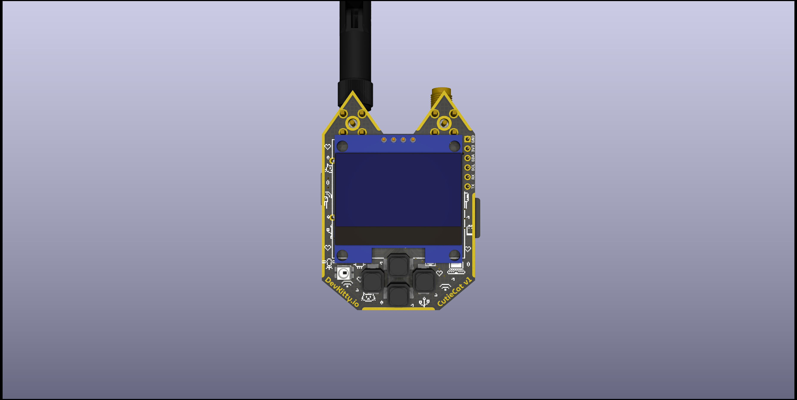

# CutieCat
Build your own Cat-Themed console for hacking & prototyping, based around the [Adafruit QT-PY]() microcontroller!
*Learn more at [DevKitty.io](https://devkitty.io)*

<!--  -->

#### Resources:
- [Assembly Guide](https://hackster.io)
- [Product Docs](https://docs.devkitty.io/cutiecat)

## Version
### Change Log

##### PCB: `v1.1`  
- Increased header margin
- Swapped soft buttons for clicky buttons (better feel)
- THT compatible Xiao / QT-Py footprint
- Annotate step #2 + tape area 

##### Case: `r1.1`
- `r1.0` Same enclosure as `v1.0` PCB
- `r1.0` New D-Pad (increase height)
- `r1.1` Universal top design - just swap the backplate! (see pic)
- `r1.2` TODO - hex cutouts, multiple SMA backplates
- `r1.3` TODO - threaded & rugged cases

### Naming convention:
`ver_name_mod_rev` eg: (`v1.1_CutieCat-Case_Top-S1_r1.1`)  

`ver` denotes the main PCB revision, which enclosure designs + mods revolve around.  To disambiguify changes to enclosures etc. a `rev` number is used.

`S#` in case files indicate how many SMA ports are accomodated.   
   
## Contents
- **src**
   - **pcb**: KiCAD PCB design files
   - **cases**: FreeCAD enclosure design files
- **exports**: ready to order / print files
- **assets**: board outline, graphic art for design, renders

## Circuit Board
CutieCat is designed to be accessible & affordable for beginners - whether you want to get started soldering or hacking!  The design uses off-the-shelf components available on Amazon, and you can even [fabricate the PCB](https://pcbway.com) yourself. 

### Main Components
|Name|Details|Number|
|---|---|---|
|Screen|SH1106 1.3" I2C OLED|1|
|Microcontroller|QT Py / Seeed Xiao|1|
|Expansion Header|6-Pin Female 2.54mm|1|

### Other Components
|Name|Details|Number|
|---|---|---|
|Buttons|`5.3 x 5.3 x 1.5` Tactile Buttons|4|
|RGB LED|SK6812 "NeoPixel"|1|

### Design Choices
*pictures coming*

##### Microcontroller
The [Seeed Xiao](), also compatible with the [Adafruit QT-Py](), is a low-profile microcontroller form factor.  You can solder it directly on the board with the castellated pads - or use through-hole headers if you're not comfortable with SMD!

Both brands offer breakouts for popular MCU's like the RP2040, SAMD, and my favorite - the ESP32.  CutieCat ships with an ESP32 since our firmware is built to teach educational hacking.

But you can easily swap in your own microcontroller!  There's even plenty of modular, compatible add-on boards from [Seeed]() or [Adafruit]().

##### Screen
The `SH1106` is a ubiquitous screen in the common `128x64` resolution.  These cheap screens sometimes have swapped pins so I added a square matrix that lets you switch them with and exacto blade and solder.

Pads on the board topside are slightly larger in case I ever design a castellated version of the SH1106 that mounts flush.  

Sticky tape is used instead to standoff the off-the-shelf SH1106.

##### Expansion
You can expand using the onboard header or **modchip** area.  Both breakout UART and I2C with 3.3v - as most peripherals are - but USB / 5V power is available through probe pads if needed.

**Minimeter** is a propietary charging circuit I made after getting pissed off with the unavailability of drop-in charging solutions.  You can also read the battery level over I2C.  [Eventually you can buy one here.](shop.devkitty.io/minimeter)

##### Antenna
Whether you want to solder on a second microcontroller for Bluetooth Recon or GPS for wardriving - you can benefit from external antennas!  

The "ears" originally fit an `M2.5` threaded screw but I decided later down the line to widen them slightly to accomodate these [u.fl to SMA]() board-mount antennas.

##### Peripherals
**Buttons**: I was very fond of the soft buttons used in `v1.0` - but they felt too gummy behind a 3D printed D-Pad so low-profile clicky ones were selected instead.

**Connectors**: UART & I2C are broken out in [Qwiic]() style headers - which support hundreds of [Adafruit]() and [Sparkfun]() sensors.  

**SD Card**: It uses SPI - a communication protocol that typically requires a select pin to switch between other devices also using SPI.  Since there weren't enough pins, I tied `CS` (chip select to ground).  You can cut the CS trace if you wish to use other SPI peripherals.

**NeoPixel**: I had space so why not?  Uses the SK6812 RGB LED, on the MCU RX pin.  

## Enclosure
The case should be as modular as possible to reduce waste.  I designed a single "top" enclosure with 2 circular SMA cutouts if the user chooses to solder those on later.

The bottom enclosures can be printed with necessary SMA cutouts.

##### Versions
- `S0/S1/S2`: Denotes number of SMA cutouts
- `Hex`: Hex pattern cutout
- `Rugged`: 1/4" 20 compatible threaded mounting 